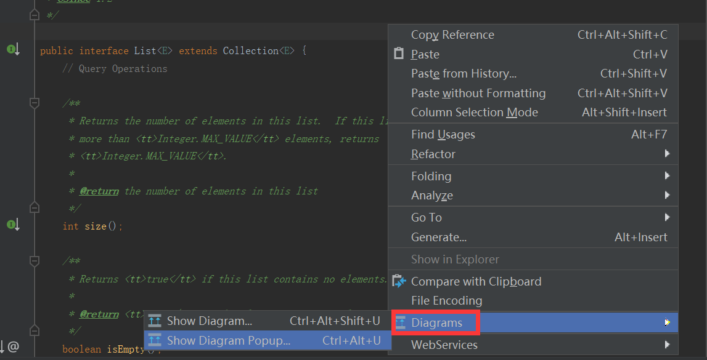
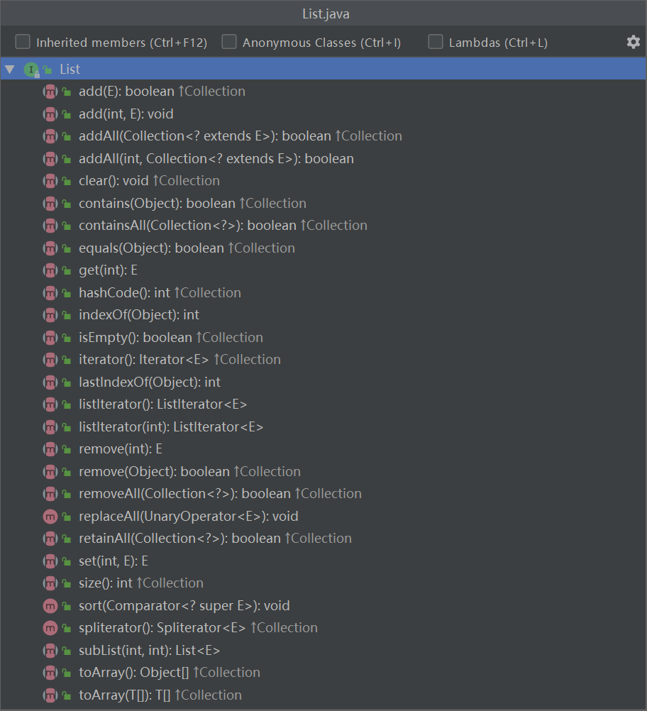
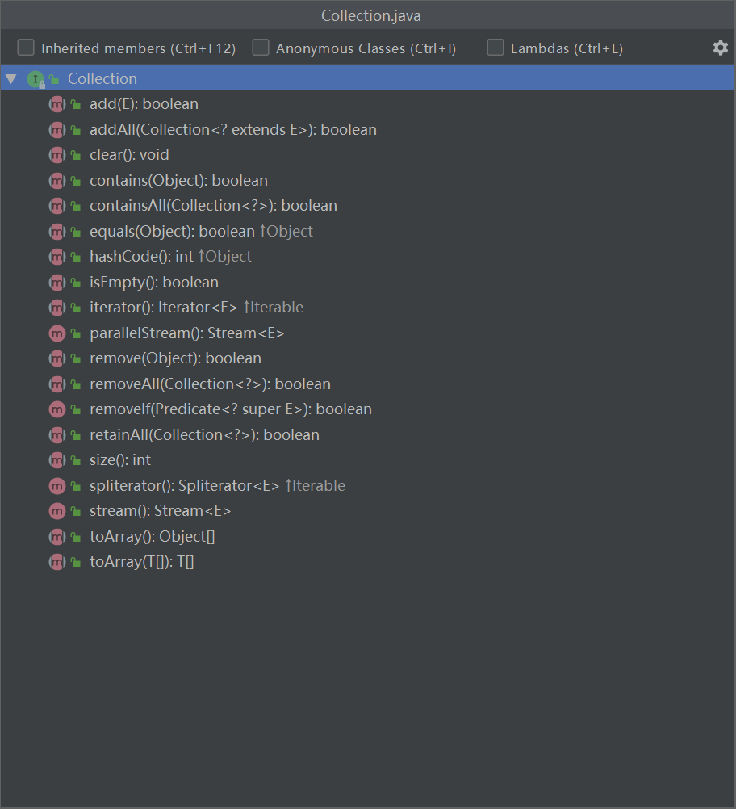
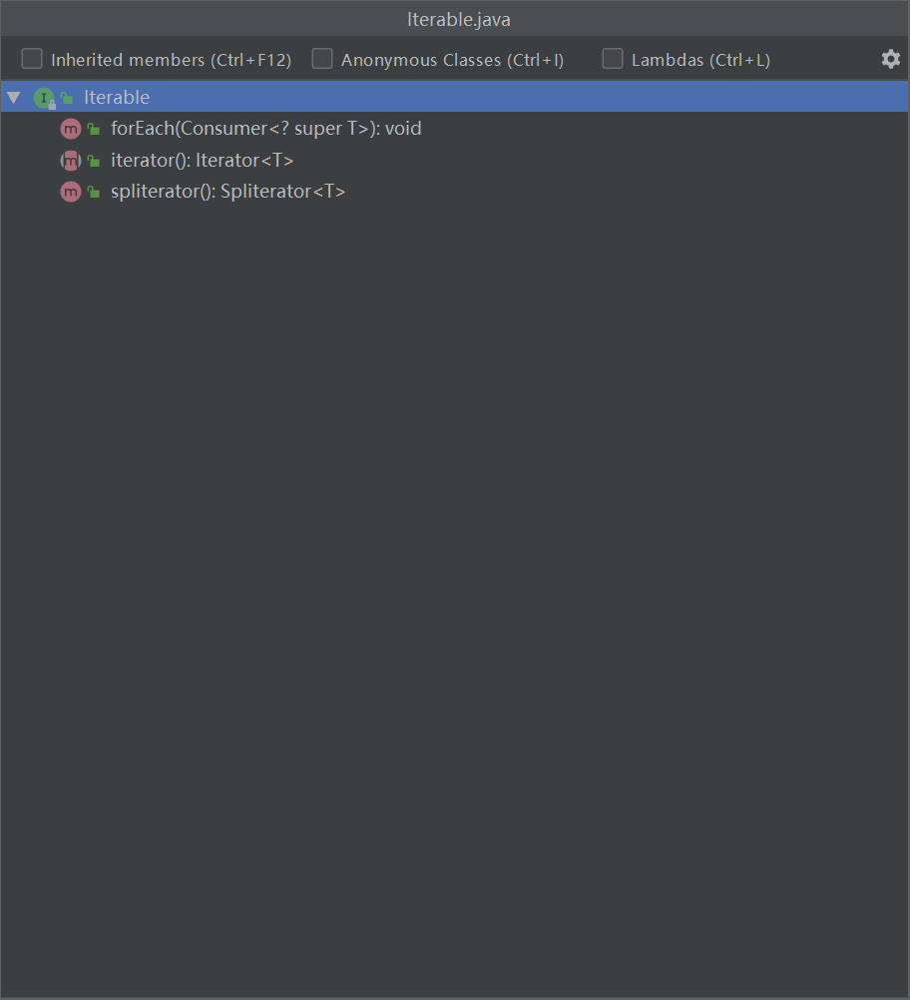
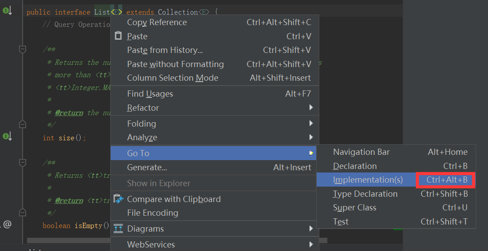
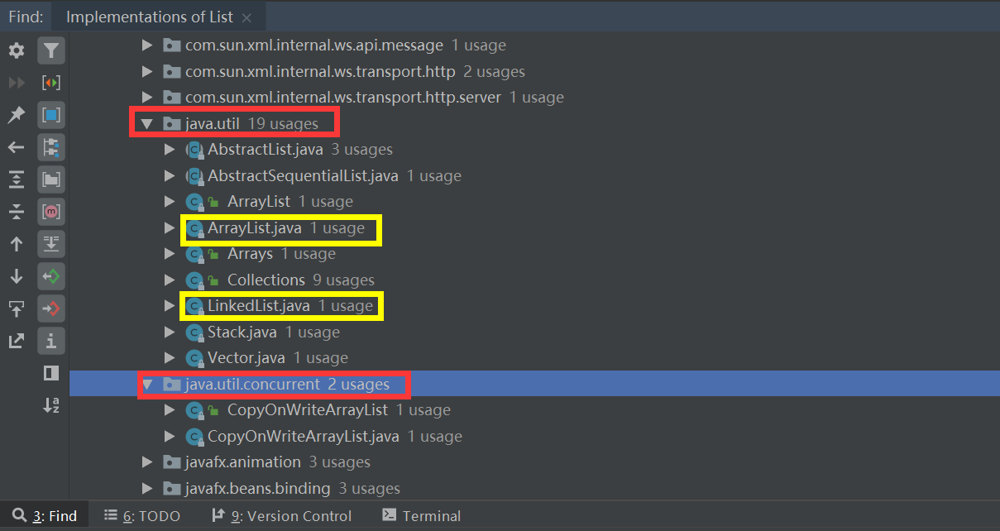
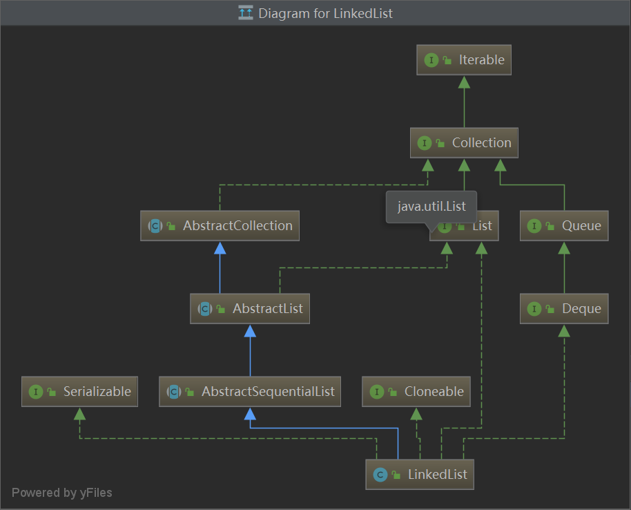

# 如何学习

学习无非横向纵向对比思考。以List接口学习为例

# 先看定义/大纲

按 `Ctrl+F12` 看大纲，把方法都看一遍，有些方法看名字就知道什么意思怎么用，有些则要去看看注释。

- List的大纲
  

把继承/实现的每一个的大纲都看看。

- Collection的大纲
  

- Iterable的大纲
  

# 再看实现类

重点看看jdk实现了那些（`java.`开头的），挑重要的来看看

如这里选择最常规的 `ArrayList` 和 `LinkedList` 来查看。

- 看继承/实现图

每一个接口和父类都一样的查看思路。在查看的过程中，思考和学习jdk的代码结构思路，为什么他这样划分，自己设计会怎么样设计，自己的设计有什么问题，jdk的设计有什么好处，这才是最重要对自己提升最大的部分。

接着看 `LinkedList` 的图，比较和思考他们的异同。

