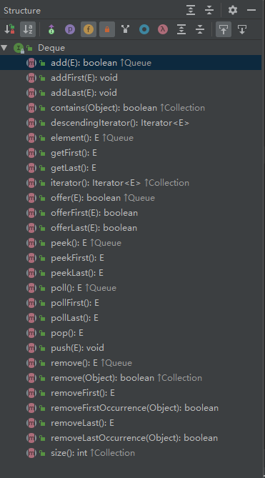
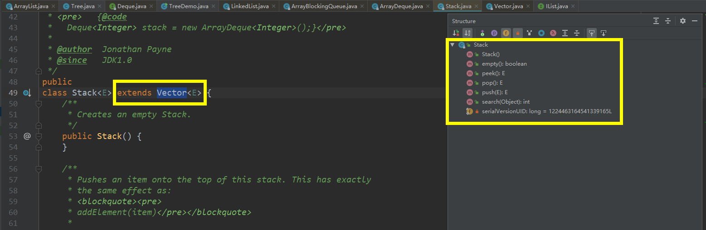

# List 、Map 和 Set

把方法都看一遍，其实有很多很有用的方法，很多人没有留意。你不知道有这个方法，就会写多几行代码，还很可能报错。

## 知识点

### List

- 各种方法
- ArrayList和LinkedList的特点、使用场景
- while/for/iterator/listIterator遍历
- 可以边修改边遍历的 ListIterator 
- LinkedList是个Deque（双端队列），也有不少使用场景 [参考1](https://blog.csdn.net/ustcjackylau/article/details/42454779) 

- Vector

### Map

- 各种方法
  - 构造方法
  - putIfAbsent
  - remove(Object key, Object value)
  - [merge、compute、computeIfAbsent、computeIfPresent](https://blog.csdn.net/russle/article/details/79772198)
- HashMap/HashTable/LinkedHashMap/TreeMap 特点、使用场景
  - LinkedHashMap使用场景很多
- Map的遍历

### Set

Set是使用Map实现的，和Map一一对应，只是Value是一个固定值而已。

- 固定的Value

```java
    // Dummy value to associate with an Object in the backing Map
    private static final Object PRESENT = new Object();
```

> LinkedHashSet 里面使用LinkedHashMap的方式比较特别。[参见这里](http://wiki.jikexueyuan.com/project/java-collection/linkedhashset.html)

### Queue、Deque

ArrayDeque/ LinkedList

[参考](https://segmentfault.com/a/1190000016524796)

### Stack

`Stack` 是个类，继承于 `Vector`，而 `Queue`、`Deque` 是接口。



## 作业

- 在list中随机增加N个数据，然后把符合条件的数据删除掉
  - 分别使用while/listIterator实现

## 思考题

- 为什么 LinkedList 没有参数为int的构造方法，而ArrayList有？
- 为什么 ArrayList 实现了 RandomAccess ，而LinkedList没有？为什么RandomAccess接口里面什么也没有？
- HashCode在Map中的关键作用？
- 什么会影响Map的效率？