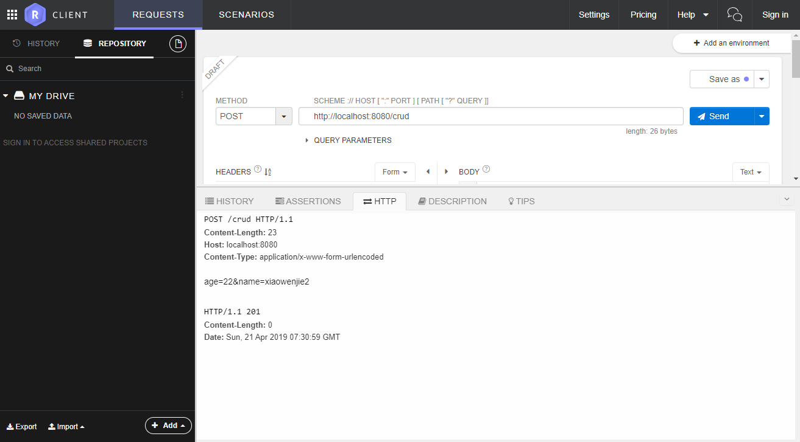

# CRUD基本开发

[代码目录](../j2ee-eclipse-projects/servlet-crud-demo1)

## 需求

使用http对应的method实现CRUD。`Restful` 就是这样的。实际工作中不会这样用。

- GET 方法，带id查询对应的数据，不带id查询所有数据
- POST 方法，新建数据
- DELETE 方法，删除数据
- PUT方法，修改数据

## 实现步骤

- 定义数据结构

定义`User`对象，定义如下

| 字段名 | 含义 | 类型 |
| :--: | :---: | :--:|
| ID    | id  | int |
| AGE   |年龄|  int|
| NAME  | 名字 | String |

- 定义接口

接口最重要的是输入输出，然后是正常异常场景。

## 编码实现

先创建一个 `UserService` 类，把crud操作放里面，然后servlet里面是入口，调用里面的方法。

Servlet 中增加对于的方法， doPut, doGet, doPost, doDelete 4个方法，然后获取参数，调用 UserService 方法，返回数据到前台。

### 创建数据

```java
protected void doPost(HttpServletRequest request, HttpServletResponse response)
        throws ServletException, IOException {
    // POST方法里面调用getParameter方法
    // 如果没有 Content-Type: application/x-www-form-urlencoded 参数必须在url上
    // 如果有，参数在url或者body上都可以
    // 实际上不太需要纠结这些细节，spring等框架封装好了

    // FIXME 实际上做好判空等异常
    int age = Integer.parseInt(request.getParameter("age"));
    String name = request.getParameter("name");

    User user = this.userService.createUser(name, age);
    System.out.println("user create success:" + user);

    // 创建成功，可以返回新对象
    // RESTFUL 的规范是返回201（body无东西），对象创建成功  201 Created.
    // 也可以返回 204，无内容
    response.setStatus(201);
}
```

使用 `restlet` 测试



- 问题
  
`http://localhost:8080/crud` 提交成功，`http://localhost:8080/crud/` 多了一个斜杆后，提交报 `404` 错误。

- 解决

```xml
<servlet-mapping>
  <servlet-name>CrudServlet</servlet-name>
  <url-pattern>/crud</url-pattern>
</servlet-mapping>
```

改为

```xml
<servlet-mapping>
  <servlet-name>CrudServlet</servlet-name>
  <url-pattern>/crud/*</url-pattern>
</servlet-mapping>
```

### 查询数据

如果有带ID，查询一个用户，如果没有带ID，返回所有数据

> 实际上开发中，不要这样设计接口。不要有时候返回单个，有时候返回集合。这是设计大忌。

得到URL上的传入的id，看起来简单，但要考虑周全，如 `/crud`, `/crud/`, `/curd/1` , 这里就不考虑异常情况。大家可以自己写一下。

```java
/**
  * 查询数据
  * @param request
  * @param response
  * @throws ServletException
  * @throws IOException
  */
protected void doGet(HttpServletRequest request, HttpServletResponse response)
        throws ServletException, IOException {
    // 从url上获取id
    String id = extractUrlId(request.getRequestURI());

    System.out.println("get user, id:" + id);

    if (id == null) {
        Collection<User> users = this.userService.queryAllUser();
        outPut(response, users);
    } else {
        User user = this.userService.queryById(Integer.parseInt(id));
        outPut(response, user);
    }
}

/**
  * 输出数据
  * @param response
  * @param obj
  * @throws IOException
  */
private void outPut(HttpServletResponse response, Object obj) throws IOException {
    if (obj != null) {
        // 输出格式，纯文本
        response.getWriter().append(obj.toString());
    }
}

/**
  * 得到 url 后面的参数
  *
  * @param url
  * @return
  */
public static String extractUrlId(String url) {
    String[] params = url.split("/");
    // System.out.println(Arrays.toString(params));

    if (params.length <= 2) {
        return null;
    } else {
        return params[2];
    }
}
```

其他的几个操作类似。


## 返回json数据

需要学习http头里面的`Content-Type`的几个取值和重要作用。

主要是增加 `response.setContentType("text/json; charset=utf-8");` , 然后需要引入json工具库。我们这里使用 `fastjson` 。

```java
/**
  * 输出数据
  * @param response
  * @param obj
  * @throws IOException
  */
private void outPut(HttpServletResponse response, Object obj) throws IOException {
    response.setContentType("text/json; charset=utf-8");

    if (obj != null) {
        // 输出格式，纯文本
        response.getWriter().append( toJson(obj) ) ;
    }
}

/**
  * 转换为json字符串
  * TODO: 实际上应该单独一个工具类出来
  * @param obj
  * @return
  */
private static String toJson(Object obj) {
    return JSON.toJSONString(obj);
}
```

## 返回试图


## 改进地方

- id 应该用long类型
- 考虑多个请求并发，使用线程安全的id序列和map

## 学习重点

除了技术，更加重要的是学会写方法。不只是实现功能，学会写函数才是重中之重！！

- 数据的获取
- 数据的返回
- Restful的风格